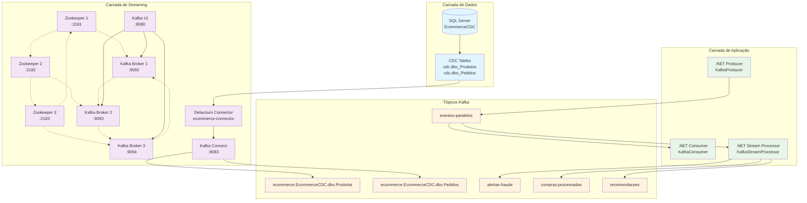

# Arquitetura Geral: CDC → Debezium → Zookeeper → Kafka

## Visão Macro da Solução

Este diagrama apresenta a arquitetura completa da solução de streaming de dados implementada.



## Componentes da Arquitetura

### 🗄️ **Camada de Dados**
- **SQL Server**: Banco principal com CDC habilitado
- **CDC Tables**: Tabelas de captura de mudanças automáticas

### 🔄 **Camada de Streaming**
- **Debezium Connector**: Captura mudanças do CDC e envia para Kafka
- **Zookeeper Ensemble**: Coordenação distribuída (3 nós para alta disponibilidade)
- **Kafka Cluster**: Processamento distribuído (3 brokers)
- **Kafka Connect**: Infraestrutura para conectores
- **Kafka UI**: Interface web para monitoramento

### 💻 **Camada de Aplicação**
- **.NET Producer**: Gera eventos de e-commerce
- **.NET Consumer**: Processa eventos com analytics
- **.NET Stream Processor**: Pipeline de processamento em tempo real

### 📊 **Tópicos Kafka**
- **CDC Topics**: Mudanças capturadas do banco
- **Application Topics**: Eventos de aplicação
- **Processing Topics**: Resultados do processamento

## Fluxo de Dados

### 1. **Captura (CDC)**
```
SQL Server → CDC Tables → Debezium → Kafka Topics
```

### 2. **Processamento (Streaming)**
```
Kafka Topics → .NET Applications → Processed Topics
```

### 3. **Coordenação (Zookeeper)**
```
Zookeeper Ensemble ↔ Kafka Cluster
```

## Características da Arquitetura

### ✅ **Alta Disponibilidade**
- Zookeeper: 3 nós (tolerância a 1 falha)
- Kafka: 3 brokers (replicação factor 3)
- Debezium: Reconexão automática

### ⚡ **Performance**
- Particionamento por chave (user_id)
- Processamento paralelo
- Replicação assíncrona

### 🔒 **Confiabilidade**
- Offsets commitados
- Reprocessamento possível
- Durabilidade configurável

### 📈 **Escalabilidade**
- Partições múltiplas
- Consumidores em grupo
- Brokers adicionais

## Casos de Uso Implementados

### 🛒 **E-commerce Real-time**
- Eventos de usuário (login, view, purchase)
- Analytics em tempo real
- Detecção de fraude
- Sistema de recomendações

### 📊 **Data Pipeline**
- Captura de mudanças automática
- Transformação de dados
- Enriquecimento de eventos
- Distribuição para múltiplos consumidores

---

**Próximo**: [CDC SQL Server](./02-cdc-sqlserver.md)
