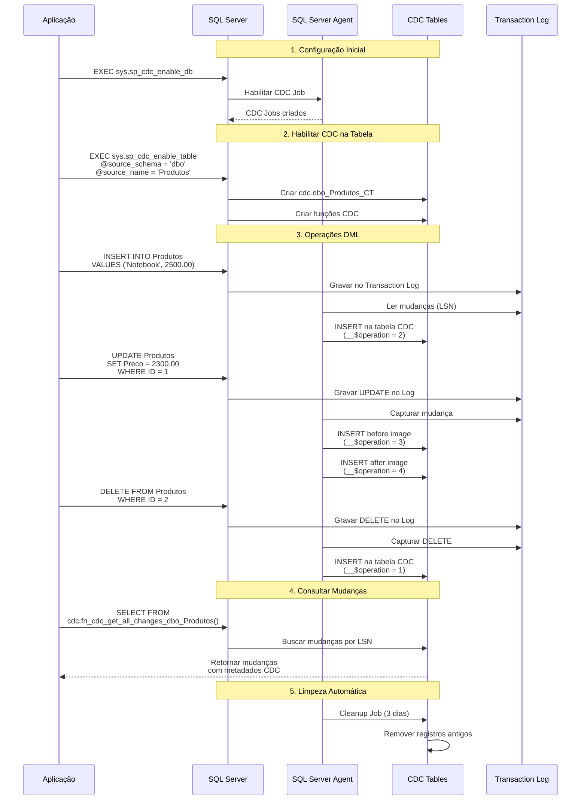

# CDC SQL Server: Captura de Mudanças

## Diagrama de Sequência - CDC em Ação



## Componentes CDC

### 🗄️ **SQL Server Database**
- **EcommerceCDC**: Database principal
- **Produtos**: Tabela de origem
- **Pedidos**: Tabela de origem

### ⚙️ **SQL Server Agent**
- **CDC Capture Job**: Captura mudanças do log
- **CDC Cleanup Job**: Remove dados antigos
- **Execução**: A cada 5 segundos (padrão)

### 📊 **CDC Tables**
- **cdc.dbo_Produtos_CT**: Change table para Produtos
- **cdc.dbo_Pedidos_CT**: Change table para Pedidos
- **cdc.change_tables**: Metadados das tabelas CDC

### 🔍 **CDC Functions**
- **fn_cdc_get_all_changes_**: Todas as mudanças
- **fn_cdc_get_net_changes_**: Mudanças líquidas
- **fn_cdc_get_min_lsn()**: LSN mínimo
- **fn_cdc_get_max_lsn()**: LSN máximo

## Estrutura das Mudanças CDC

### Colunas de Metadados
```sql
__$start_lsn     -- Log Sequence Number da transação
__$end_lsn       -- LSN final (para updates)
__$seqval        -- Sequência dentro da transação
__$operation     -- Tipo de operação:
                 --   1 = DELETE
                 --   2 = INSERT  
                 --   3 = UPDATE (before)
                 --   4 = UPDATE (after)
__$update_mask   -- Máscara das colunas alteradas
```

### Exemplo de Registro CDC
```sql
-- INSERT de um produto
__$start_lsn: 0x00000020000000D70001
__$operation: 2
ProdutoID: 1
Nome: 'Notebook Dell'
Preco: 2500.00
Categoria: 'Eletrônicos'

-- UPDATE do mesmo produto  
__$start_lsn: 0x00000020000000D80001
__$operation: 3  -- before image
ProdutoID: 1
Nome: 'Notebook Dell'
Preco: 2500.00

__$start_lsn: 0x00000020000000D80001  
__$operation: 4  -- after image
ProdutoID: 1
Nome: 'Notebook Dell'
Preco: 2300.00  -- preço alterado
```

## Fluxo de Captura

### 1. **Habilitação**
```sql
-- Habilitar CDC no database
EXEC sys.sp_cdc_enable_db;

-- Habilitar CDC na tabela
EXEC sys.sp_cdc_enable_table
    @source_schema = N'dbo',
    @source_name = N'Produtos',
    @role_name = NULL;
```

### 2. **Captura Automática**
- SQL Server Agent monitora o transaction log
- Identifica mudanças nas tabelas habilitadas
- Insere registros nas change tables
- Mantém LSN para ordenação temporal

### 3. **Consulta de Mudanças**
```sql
-- Buscar todas as mudanças
SELECT 
    CASE __$operation
        WHEN 1 THEN 'DELETE'
        WHEN 2 THEN 'INSERT'
        WHEN 3 THEN 'UPDATE (antes)'
        WHEN 4 THEN 'UPDATE (depois)'
    END AS Operacao,
    *
FROM cdc.fn_cdc_get_all_changes_dbo_Produtos(
    sys.fn_cdc_get_min_lsn('dbo_Produtos'),
    sys.fn_cdc_get_max_lsn(),
    N'all'
);
```

## Vantagens do CDC

### ✅ **Captura Automática**
- Sem triggers necessários
- Performance mínima no OLTP
- Captura todas as mudanças

### ⚡ **Baixa Latência**
- Baseado no transaction log
- Captura quase em tempo real
- Ordenação garantida por LSN

### 🔒 **Confiabilidade**
- Não perde mudanças
- Transacionalmente consistente
- Recuperação após falhas

### 📊 **Metadados Ricos**
- Tipo de operação
- Timestamp da transação
- Colunas alteradas
- Before/after images

## Limitações e Considerações

### ⚠️ **Requisitos**
- SQL Server Agent deve estar rodando
- Permissões sysadmin para configuração
- Espaço adicional para change tables

### 🔧 **Configurações**
- Retenção de dados (padrão: 3 dias)
- Frequência de captura (padrão: 5 segundos)
- Limpeza automática configurável

### 📈 **Monitoramento**
- Status dos jobs CDC
- Tamanho das change tables
- LSN gaps (falhas de captura)

---

**Próximo**: [Debezium Connector](./03-debezium-connector.md)
