# Debezium Connector: CDC para Kafka

## Diagrama de Sequência - Debezium em Ação

```mermaid
sequenceDiagram
    participant Admin as Administrador
    participant KC as Kafka Connect
    participant DEB as Debezium Connector
    participant SQL as SQL Server CDC
    participant KAF as Kafka Broker
    participant ZK as Zookeeper

    Note over Admin,ZK: 1. Configuração Inicial
    Admin->>KC: POST /connectors<br/>sqlserver-connector.json
    KC->>DEB: Criar instância do conector
    DEB->>SQL: Testar conexão
    SQL-->>DEB: Conexão OK
    DEB->>ZK: Registrar estado do conector

    Note over Admin,ZK: 2. Snapshot Inicial
    DEB->>SQL: SELECT * FROM Produtos<br/>WHERE CDC habilitado
    SQL-->>DEB: Dados atuais da tabela
    DEB->>KAF: Produzir snapshot<br/>ecommerce.EcommerceCDC.dbo.Produtos
    KAF->>ZK: Atualizar offsets
    DEB->>ZK: Salvar LSN inicial

    Note over Admin,ZK: 3. Streaming de Mudanças
    loop Polling Contínuo
        DEB->>SQL: Consultar CDC changes<br/>FROM fn_cdc_get_all_changes
        SQL-->>DEB: Mudanças desde último LSN
        
        alt Mudanças encontradas
            DEB->>DEB: Transformar para Avro/JSON
            DEB->>KAF: Produzir eventos<br/>com schema registry
            KAF->>ZK: Commit offsets
            DEB->>ZK: Salvar último LSN processado
        else Sem mudanças
            DEB->>DEB: Sleep (1 segundo)
        end
    end

    Note over Admin,ZK: 4. Tratamento de Falhas
    DEB->>SQL: Consultar mudanças
    SQL-->>DEB: Connection timeout
    DEB->>DEB: Retry com backoff
    DEB->>SQL: Reconectar
    SQL-->>DEB: Conexão restaurada
    DEB->>ZK: Recuperar último LSN
    DEB->>SQL: Continuar de onde parou

    Note over Admin,ZK: 5. Monitoramento
    Admin->>KC: GET /connectors/ecommerce-connector/status
    KC-->>Admin: Status: RUNNING<br/>Tasks: 1 RUNNING
    Admin->>KC: GET /connectors/ecommerce-connector/tasks/0/status
    KC-->>Admin: Última atividade<br/>Registros processados
```



## Configuração do Debezium Connector

### 📋 **Arquivo de Configuração**
```json
{
  "name": "ecommerce-connector",
  "config": {
    "connector.class": "io.debezium.connector.sqlserver.SqlServerConnector",
    "database.hostname": "sqlserver-cdc",
    "database.port": "1433",
    "database.user": "sa",
    "database.password": "MinhaSenh@123",
    "database.names": "EcommerceCDC",
    "database.encrypt": "false",
    "topic.prefix": "ecommerce",
    "table.include.list": "dbo.Produtos,dbo.Pedidos",
    "schema.history.internal.kafka.bootstrap.servers": "kafka:29092",
    "schema.history.internal.kafka.topic": "ecommerce.history",
    "snapshot.mode": "initial",
    "transforms": "unwrap",
    "transforms.unwrap.type": "io.debezium.transforms.ExtractNewRecordState"
  }
}
```

### 🔧 **Parâmetros Principais**

#### **Conexão**
- `database.hostname`: Host do SQL Server
- `database.port`: Porta (1433)
- `database.user/password`: Credenciais
- `database.names`: Databases a monitorar

#### **Tópicos**
- `topic.prefix`: Prefixo dos tópicos Kafka
- `table.include.list`: Tabelas específicas
- Resultado: `ecommerce.EcommerceCDC.dbo.Produtos`

#### **Schema Registry**
- `schema.history.internal.kafka.topic`: Histórico de schemas
- `key.converter`: Conversor de chaves
- `value.converter`: Conversor de valores

#### **Snapshot**
- `snapshot.mode: initial`: Snapshot completo inicial
- `snapshot.mode: schema_only`: Apenas schema
- `snapshot.mode: never`: Sem snapshot

## Fluxo de Dados Debezium

### 1. **Snapshot Inicial**


### 2. **Streaming de Mudanças**
```mermaid
graph LR
    CDC[CDC Tables<br/>cdc.dbo_Produtos_CT] --> DEB[Debezium<br/>Streaming]
    DEB --> KAF[Kafka Topic]
    
    subgraph "Change Events"
        INS[INSERT<br/>op: 'c' (create)]
        UPD[UPDATE<br/>op: 'u' (update)]
        DEL[DELETE<br/>op: 'd' (delete)]
    end
    
    DEB --> INS
    DEB --> UPD  
    DEB --> DEL
```

## Estrutura dos Eventos Kafka

### 📨 **Evento de INSERT**
```json
{
  "schema": { /* Schema Avro */ },
  "payload": {
    "op": "c",
    "before": null,
    "after": {
      "ProdutoID": 1,
      "Nome": "Notebook Dell",
      "Preco": 2500.00,
      "Categoria": "Eletrônicos"
    },
    "source": {
      "version": "2.4.0",
      "connector": "sqlserver",
      "name": "ecommerce",
      "ts_ms": 1695901234567,
      "snapshot": "false",
      "db": "EcommerceCDC",
      "schema": "dbo",
      "table": "Produtos",
      "change_lsn": "00000020:000000d7:0001",
      "commit_lsn": "00000020:000000d7:0002"
    },
    "ts_ms": 1695901234567
  }
}
```

### 📨 **Evento de UPDATE**
```json
{
  "payload": {
    "op": "u",
    "before": {
      "ProdutoID": 1,
      "Nome": "Notebook Dell",
      "Preco": 2500.00
    },
    "after": {
      "ProdutoID": 1,
      "Nome": "Notebook Dell",
      "Preco": 2300.00
    },
    "source": {
      "change_lsn": "00000020:000000d8:0001"
    }
  }
}
```

### 📨 **Evento de DELETE**
```json
{
  "payload": {
    "op": "d",
    "before": {
      "ProdutoID": 2,
      "Nome": "Mouse Wireless"
    },
    "after": null,
    "source": {
      "change_lsn": "00000020:000000d9:0001"
    }
  }
}
```

## Transformações (SMT)

### 🔄 **ExtractNewRecordState**
```json
"transforms": "unwrap",
"transforms.unwrap.type": "io.debezium.transforms.ExtractNewRecordState",
"transforms.unwrap.drop.tombstones": "false"
```

**Antes da transformação:**
```json
{
  "op": "c",
  "before": null,
  "after": { "id": 1, "nome": "Produto" }
}
```

**Depois da transformação:**
```json
{
  "id": 1,
  "nome": "Produto"
}
```

## Monitoramento e Troubleshooting

### 📊 **Status do Connector**
```bash
# Status geral
curl http://localhost:8083/connectors/ecommerce-connector/status

# Métricas detalhadas
curl http://localhost:8083/connectors/ecommerce-connector/tasks/0/status
```

### 🔍 **Logs Importantes**
```bash
# Logs do Kafka Connect
docker logs connect

# Filtrar logs do Debezium
docker logs connect | grep "ecommerce-connector"
```

### ⚠️ **Problemas Comuns**

#### **Schema History Error**
```
Error: schema.history.internal.kafka.topic not found
```
**Solução**: Verificar conectividade com Kafka e criar tópico

#### **LSN Gap**
```
Warning: LSN gap detected
```
**Solução**: Verificar se SQL Server Agent está rodando

#### **Connection Timeout**
```
Error: Connection to SQL Server failed
```
**Solução**: Verificar rede e credenciais

## Performance e Otimização

### ⚡ **Configurações de Performance**
```json
{
  "max.batch.size": "2048",
  "max.queue.size": "8192", 
  "poll.interval.ms": "1000",
  "snapshot.fetch.size": "10240"
}
```

### 📈 **Métricas Importantes**
- **Records processed**: Registros processados
- **Lag**: Atraso entre CDC e Kafka
- **Throughput**: Registros por segundo
- **Error rate**: Taxa de erros

---

**Próximo**: [Zookeeper Ensemble](./04-zookeeper-ensemble.md)
