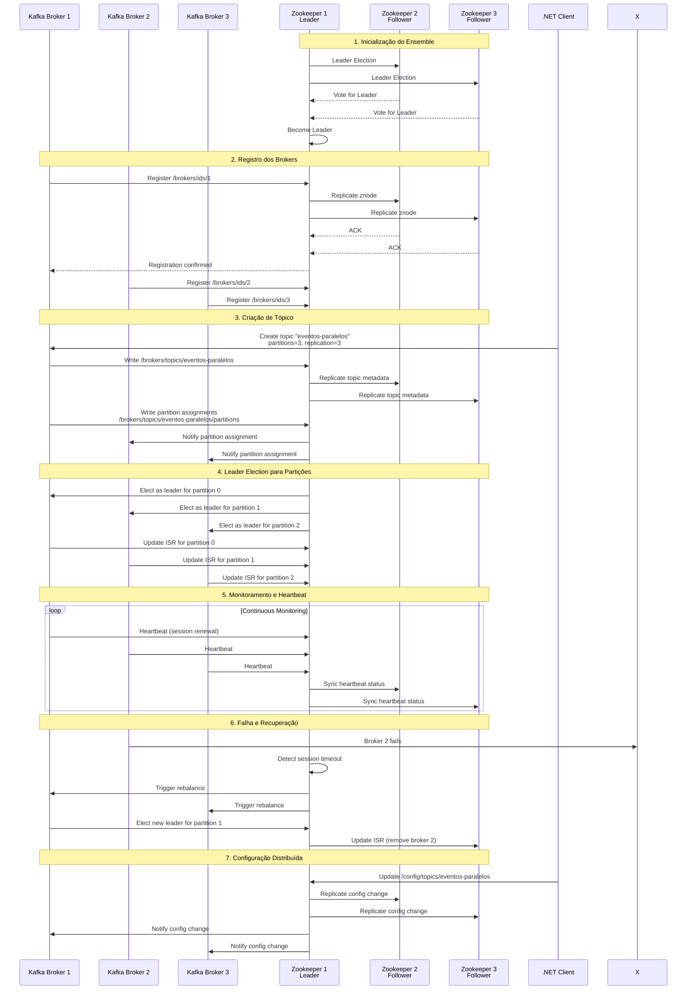
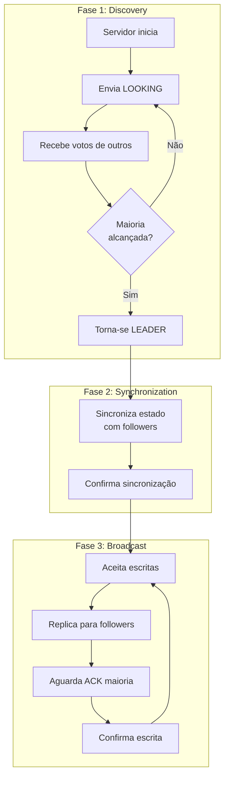

# Zookeeper Ensemble: Coordenação Distribuída

## Diagrama de Sequência - Zookeeper Coordination



## Estrutura de Dados Zookeeper

### 🌳 **Árvore de Znodes Kafka**
```
/
├── brokers/
│   ├── ids/
│   │   ├── 1 → {"host":"kafka1","port":29092}
│   │   ├── 2 → {"host":"kafka2","port":29092}  
│   │   └── 3 → {"host":"kafka3","port":29092}
│   ├── topics/
│   │   └── eventos-paralelos/
│   │       └── partitions/
│   │           ├── 0/
│   │           │   └── state → {"leader":1,"isr":[1,2,3]}
│   │           ├── 1/
│   │           │   └── state → {"leader":2,"isr":[1,2,3]}
│   │           └── 2/
│   │               └── state → {"leader":3,"isr":[1,2,3]}
├── controller/
│   └── epoch → {"brokerid":1,"epoch":1}
├── config/
│   ├── topics/
│   │   └── eventos-paralelos → {"retention.ms":"604800000"}
│   └── brokers/
│       └── 1 → {"log.retention.hours":"168"}
└── consumers/
    └── analytics-processor-dotnet/
        ├── owners/
        └── offsets/
```

## Configuração do Ensemble

### ⚙️ **Docker Compose - Zookeeper Cluster**
```yaml
version: '3.8'
services:
  zk1:
    image: confluentinc/cp-zookeeper:7.4.0
    hostname: zk1
    ports:
      - "2181:2181"
    environment:
      ZOOKEEPER_SERVER_ID: 1
      ZOOKEEPER_CLIENT_PORT: 2181
      ZOOKEEPER_TICK_TIME: 2000
      ZOOKEEPER_INIT_LIMIT: 5
      ZOOKEEPER_SYNC_LIMIT: 2
      ZOOKEEPER_SERVERS: zk1:2888:3888;zk2:2888:3888;zk3:2888:3888

  zk2:
    image: confluentinc/cp-zookeeper:7.4.0
    hostname: zk2
    ports:
      - "2182:2181"
    environment:
      ZOOKEEPER_SERVER_ID: 2
      # ... mesmas configurações com SERVER_ID diferente

  zk3:
    image: confluentinc/cp-zookeeper:7.4.0
    hostname: zk3  
    ports:
      - "2183:2181"
    environment:
      ZOOKEEPER_SERVER_ID: 3
      # ... mesmas configurações com SERVER_ID diferente
```

### 🔧 **Parâmetros de Configuração**

#### **Timing**
- `TICK_TIME: 2000`: Unidade básica de tempo (2s)
- `INIT_LIMIT: 5`: Timeout para followers conectarem (10s)
- `SYNC_LIMIT: 2`: Timeout para sincronização (4s)

#### **Cluster**
- `SERVER_ID`: Identificador único do servidor
- `SERVERS`: Lista de todos os servidores do ensemble
- `CLIENT_PORT`: Porta para clientes (2181)

#### **Comunicação**
- `2888`: Porta para comunicação entre servidores
- `3888`: Porta para eleição de líder

## Algoritmo de Consenso

### 🗳️ **Leader Election (ZAB Protocol)**



### 📊 **Quorum e Tolerância a Falhas**

| Ensemble Size | Quorum | Falhas Toleradas |
|---------------|--------|------------------|
| 1             | 1      | 0                |
| 2             | 2      | 0                |
| 3             | 2      | 1                |
| 4             | 3      | 1                |
| 5             | 3      | 2                |

**Regra**: `Quorum = (N/2) + 1`

## Operações com .NET (Kazoo)

### 🔗 **Conexão e Operações Básicas**
```csharp
// Equivalente em C# usando Apache.Zookeeper
using Org.Apache.Zookeeper;

public class ZookeeperClient
{
    private ZooKeeper zk;
    
    public async Task ConnectAsync()
    {
        zk = new ZooKeeper("localhost:2181,localhost:2182,localhost:2183", 
                          30000, new DefaultWatcher());
        
        // Aguardar conexão
        while (zk.State != ZooKeeper.States.CONNECTED)
        {
            await Task.Delay(100);
        }
    }
    
    public async Task CreateNodeAsync(string path, string data)
    {
        await zk.createAsync(path, 
                           Encoding.UTF8.GetBytes(data),
                           ZooDefs.Ids.OPEN_ACL_UNSAFE,
                           CreateMode.PERSISTENT);
    }
    
    public async Task<string> GetDataAsync(string path)
    {
        var result = await zk.getDataAsync(path, false);
        return Encoding.UTF8.GetString(result.Data);
    }
}
```

### 👁️ **Watches e Notificações**
```csharp
public class ZookeeperWatcher : Watcher
{
    public override Task process(WatchedEvent @event)
    {
        Console.WriteLine($"Event: {@event.Type} on {@event.Path}");
        
        switch (@event.Type)
        {
            case Event.EventType.NodeCreated:
                Console.WriteLine($"Node created: {@event.Path}");
                break;
            case Event.EventType.NodeDataChanged:
                Console.WriteLine($"Data changed: {@event.Path}");
                break;
            case Event.EventType.NodeDeleted:
                Console.WriteLine($"Node deleted: {@event.Path}");
                break;
        }
        
        return Task.CompletedTask;
    }
}

// Uso
await zk.getDataAsync("/brokers/ids/1", new ZookeeperWatcher());
```

## Casos de Uso no Kafka

### 🎯 **Service Discovery**
```
/brokers/ids/1 → {"host":"kafka1","port":29092,"rack":"rack1"}
/brokers/ids/2 → {"host":"kafka2","port":29092,"rack":"rack2"}
/brokers/ids/3 → {"host":"kafka3","port":29092,"rack":"rack3"}
```

### ⚖️ **Load Balancing**
- Clientes consultam `/brokers/ids` para descobrir brokers
- Distribuem conexões entre brokers disponíveis
- Recebem notificações quando brokers saem/entram

### 🔄 **Configuration Management**
```
/config/topics/eventos-paralelos → {
  "retention.ms": "604800000",
  "compression.type": "snappy",
  "max.message.bytes": "1000000"
}
```

### 👑 **Leader Election**
- Controller election: `/controller`
- Partition leader election: `/brokers/topics/*/partitions/*/state`
- Consumer group coordination

## Monitoramento do Ensemble

### 📊 **Métricas Importantes**
```bash
# Status do ensemble
echo "stat" | nc localhost 2181
echo "stat" | nc localhost 2182  
echo "stat" | nc localhost 2183

# Informações de configuração
echo "conf" | nc localhost 2181

# Conexões ativas
echo "cons" | nc localhost 2181
```

### 🔍 **Health Checks**
```bash
# Verificar se está respondendo
echo "ruok" | nc localhost 2181
# Resposta esperada: "imok"

# Verificar líder/follower
echo "stat" | nc localhost 2181 | grep Mode
# Resposta: Mode: leader ou Mode: follower
```

### ⚠️ **Alertas Críticos**
- **Split-brain**: Múltiplos líderes
- **Quorum loss**: Menos de 50% dos nós
- **High latency**: Sincronização lenta
- **Disk space**: Logs crescendo muito

## Troubleshooting

### 🚨 **Problemas Comuns**

#### **Quorum Loss**
```
Error: Not enough followers to form quorum
```
**Solução**: Verificar conectividade de rede entre nós

#### **Session Timeout**
```
Warning: Session timeout for client
```
**Solução**: Ajustar `sessionTimeout` ou verificar GC

#### **Split Brain**
```
Error: Multiple leaders detected
```
**Solução**: Reiniciar ensemble com dados consistentes

### 🔧 **Recovery Procedures**
1. **Backup dos dados**: `/var/lib/zookeeper/data`
2. **Verificar logs**: `/var/log/zookeeper`
3. **Reiniciar nós**: Um por vez, aguardar quorum
4. **Verificar integridade**: Comparar `myid` e dados

---

**Próximo**: [Kafka Streaming](./05-kafka-streaming.md)
